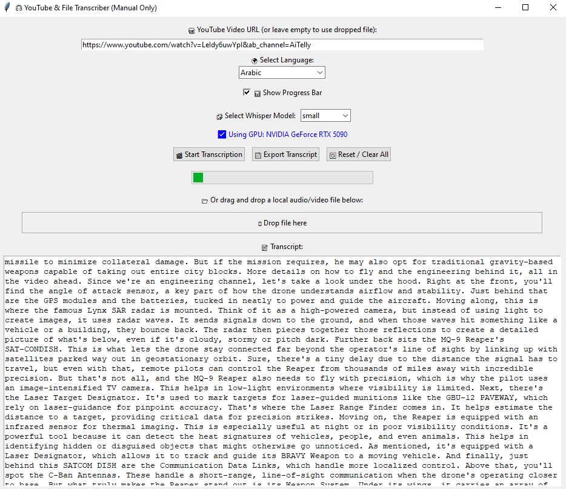

# 🎧 Whisper YouTube & Audio File Transcriber (GUI)

This is a Python desktop GUI app that uses OpenAI's Whisper model to transcribe:

- ✅ YouTube videos (via URL)
- ✅ Local audio/video files (MP3, MP4, WAV, etc.)
- ✅ Supports drag-and-drop
- ✅ Supports GPU acceleration
- ✅ Manual Whisper model selection (small, medium, large)
- ✅ Export transcript as `.txt`
- ✅ Reset interface & auto-cleanup

---
📸 Screenshots

## 🚀 How to Use

### 1. Clone the Repo

```bash
git clone https://github.com/m7mds91/yt2text.git
cd yt2text
```
### 2. Install Requirements
```bash
pip install -r requirements.txt
```
You must have ffmpeg installed and added to your system PATH.
✅ Download: https://ffmpeg.org/download.html

### 3. Run the App
```bash
python YT2text.py
```
⚙️ Dependencies
```bash
OpenAI Whisper
yt-dlp (YouTube downloader)
tkinterdnd2 (drag-and-drop GUI extension)
```
